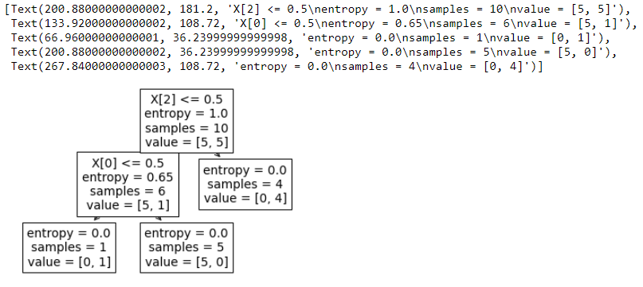

# Decision-Trees-Play
This project runs on JupiterNotebook using Python 3.
## Overview
Predict whether or not should someone go outdoor depending on weather's factors
## Dataset
play dataset
## About Dataset
the attributes includes different kind of possible weather and changes in the atmostphere
## Setting up the Decision Tree
We will be using train/test split on our decision tree
## Modeling

